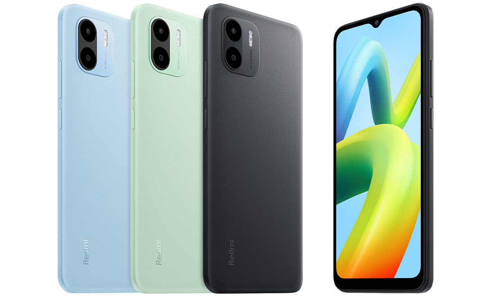
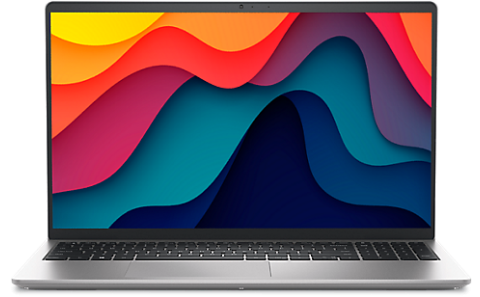
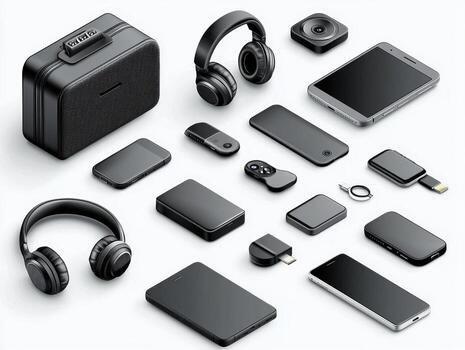
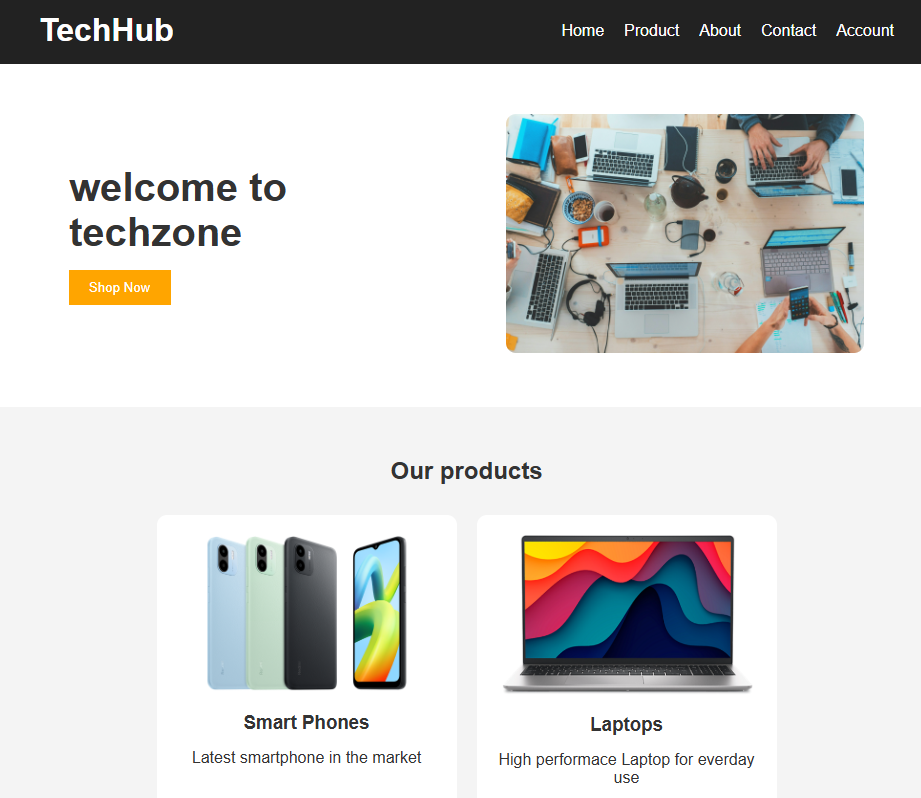
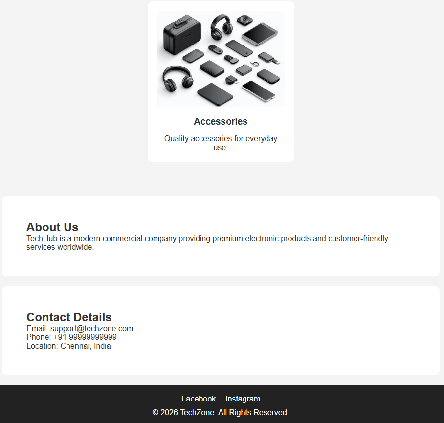

# Ex02 Commercial Website
## Date:
18-05-2026

## AIM
To create a commercial website using CSS Flexbox.

## ALGORITHM
### STEP 1
Create an HTML file (index.html)

### STEP 2
Create a CSS file (style.css)

### STEP 3
Include a navigation bar with links to different sections.

### STEP 4
Add structured sections for Homepage, Products / Services, About Us, Contact Details and User Account.

### STEP 5
Include social media links at the footer with copyright information.

### STEP 6
Define global styles for fonts, colors, and layout.

### STEP 7
Style the header, navigation bar, and sections.

### STEP 8
Use Flexbox for layout design.

### STEP 9
Add hover effects and transitions for interactivity.

### STEP 10
Add Images and Media.

### STEP 11
Use optimized images for a professional look.

### STEP 12
Open the HTML file in a browser to check layout and functionality.

### STEP 13
Fix styling issues and refine content placement.

### STEP 14
Deploy the website.

### STEP 15
Upload to GitHub Pages for free hosting.

## PROGRAM

    <!DOCTYPE html>
    <html>
    <head>
        <meta charset="utf-8">  
        <title>Commercial Website</title>
        <meta name="viewport" content="width=device-width, initial-scale=1">
        <link rel="stylesheet" href="style.css">
    </head>
    <body>
    <header>
        <h1>TechHub</h1>
        <nav>
            <ul class="nav-links">
                <li><a href="#home">Home</a></li>
                <li><a href="#products">Product</a></li>
                <li><a href="#about">About</a></li>
                <li><a href="#contact">Contact</a></li>
                <li><a href="#account">Account</a></li>
            </ul>
        </nav>
    </header>
    <section id="home" class="hero">
        

            <h2>welcome to techzone</h2>
            <button>Shop Now</button>
        

        

            
        

    </section>
    
    <section id="products">
        <h2>Our products</h2>
        

            

                
                <h3>Smart Phones</h3>
                
Latest smartphone in the market

            

            
            

                
                <h3>Laptops</h3>
                
High performace Laptop for everday use

            

            

                
                <h3>Accessories</h3>
                
Quality accessories for everyday use.

            

        

    </section>
    <section id="about">
        <h2>About Us</h2>
        

            TechHub is a modern commercial company providing premium electronic
            products and customer-friendly services worldwide.
        

    </section>
     <section id="contact">
        <h2>Contact Details</h2>
        
Email: support@techzone.com

        
Phone: +91 99999999999

        
Location: Chennai, India

    </section>
    <footer>
        

            <a href="#">Facebook</a>
            <a href="#">Instagram</a>
        

        
© 2026 TechZone. All Rights Reserved.

    </footer>
    
    </body>
    </html>
    
    
    *{
        margin: 0;
        padding: 0;
        box-sizing: border-box;
        font-family: Arial, sans-serif;
    }
    
    body{
        background-color: #f4f4f4;
        color: #333;
    }
    
    
    
    header{
        display: flex;
        justify-content: space-between;
        align-items: center;
        background-color: #222;
        color: white;
        padding: 15px 40px;
    }
    
    .nav-links{
        display: flex;
        list-style: none;
        gap: 20px;
    }
    
    .nav-links a{
        text-decoration: none;
        color: white;
        transition: 0.3s;
    }
    
    .nav-links a:hover{
        color: orange;
    }
    
    
    
    .hero{
        display: flex;
        justify-content: space-between;
        align-items: center;
        padding: 50px;
        background-color: white;
        flex-wrap: wrap;
    }
    
    .hero-text{
        flex: 1;
        padding: 20px;
    }
    
    .hero-text h2{
        font-size: 40px;
        margin-bottom: 15px;
    }
    
    .hero-text p{
        margin-bottom: 20px;
    }
    
    .hero-text button{
        padding: 10px 20px;
        border: none;
        background-color: orange;
        color: white;
        cursor: pointer;
        transition: 0.3s;
    }
    
    .hero-text button:hover{
        background-color: darkorange;
    }
    
    .hero-image{
        flex: 1;
        text-align: center;
    }
    
    .hero-image img{
        width: 90%;
        border-radius: 10px;
    }
    
    
    
    #products{
        padding: 50px;
        text-align: center;
    }
    
    .product-container{
        display: flex;
        justify-content: center;
        gap: 20px;
        flex-wrap: wrap;
        margin-top: 30px;
    }
    
    .product-card{
        background-color: white;
        width: 300px;
        padding: 20px;
        border-radius: 10px;
        transition: transform 0.3s;
    }
    
    .product-card:hover{
        transform: scale(1.05);
    }
    
    .product-card img{
        width: 100%;
        border-radius: 10px;
    }
    
    .product-card h3{
        margin: 15px 0;
    }
    
    
    
    section{
        padding: 50px;
    }
    
    #about,
    #contact{
        background-color: white;
        margin: 20px;
        border-radius: 10px;
    }
    
    form{
        display: flex;
        flex-direction: column;
        width: 300px;
        gap: 15px;
    }
    
    form input{
        padding: 10px;
    }
    
    form button{
        padding: 10px;
        border: none;
        background-color: #222;
        color: white;
        cursor: pointer;
    }
    
    
    
    footer{
        background-color: #222;
        color: white;
        text-align: center;
        padding: 20px;
    }
    
    .social-links{
        display: flex;
        justify-content: center;
        gap: 20px;
        margin-bottom: 10px;
    }
    
    .social-links a{
        color: white;
        text-decoration: none;
        transition: 0.3s;
    }
    
    .social-links a:hover{
        color: orange;
    }

## OUTPUT

## RESULT
The program for creating commercial website using CSS Flexbox is executed successfully.
